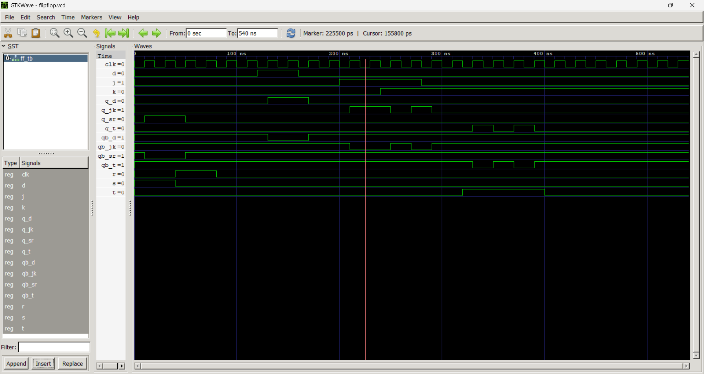

# Lab 7: VHDL Code for Sequential Circuits — Flip-Flops

## Objective
- Design and simulate SR, D, JK, and T flip-flops in VHDL.  
- Understand the role of the clock signal in sequential circuits.  

---

## Theory
A flip-flop is a bistable sequential element that stores one bit of state. Unlike combinational circuits, its output depends on both the current inputs and its previous state. Flip-flops are triggered by a clock signal, typically on the rising edge.

### SR Flip-Flop
| S | R | Q(next)       |
|---|---|---------------|
| 0 | 0 | Q (no change) |
| 0 | 1 | 0 (reset)     |
| 1 | 0 | 1 (set)       |
| 1 | 1 | X (forbidden) |

### D Flip-Flop
- Captures the value of **D** on the clock edge.  
- Formula:  
  

$Q_{next} = D$

### JK Flip-Flop
- Eliminates the forbidden state of SR.  
- Behavior:  
  - J=0, K=0 → Hold  
  - J=0, K=1 → Reset  
  - J=1, K=0 → Set  
  - J=1, K=1 → Toggle  

### T Flip-Flop
- When T=1, output toggles.  
- When T=0, output holds.  
- Formula:  
  

$Q_{next} = T \oplus Q$

---

## Output

## Discussion
- The clock signal synchronizes state changes, ensuring flip-flops update only at defined instants.  
- The SR flip-flop demonstrates the concept of forbidden states, highlighting the need for improved designs like JK.  
- The D flip-flop simplifies input handling by directly transferring the input to the output.  
- The JK flip-flop generalizes SR behavior and introduces toggling, making it versatile in counters.  
- The T flip-flop is essentially a simplified JK flip-flop, widely used in frequency division and counters.  

---

## Conclusion
- All four flip-flops were successfully modeled in VHDL and simulated.  
- The experiments reinforced the importance of the clock in sequential circuits.  
- Each flip-flop has unique characteristics:  
  - SR → basic set/reset  
  - D → data storage  
  - JK → versatility with toggle  
  - T → toggling for counters  
- These building blocks are essential for designing larger sequential systems such as registers, counters, and memory elements.  
