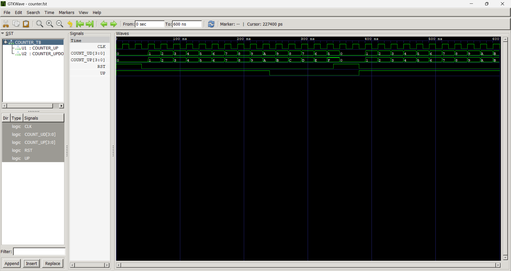

# Lab 8: VHDL Code for Sequential Circuits — Counters

## Objective
- Design and simulate a 4-bit synchronous up counter in VHDL  
- Design and simulate a 4-bit synchronous up/down counter in VHDL  

---

## Theory
A counter is a sequential circuit that cycles through a predefined sequence of states on each clock edge. Counters are built from flip-flops and are fundamental to timing, sequencing, and frequency division.

- **Synchronous counter**: All flip-flops are clocked simultaneously, making them faster and more reliable than ripple (asynchronous) counters.  
- **Up counter**: Increments the count by 1 on each clock edge.  
- **Up/Down counter**: Increments or decrements based on a direction control signal.  
- **Reset**: An active-high synchronous or asynchronous reset returns the count to zero.  

---

## Output

counters

## Discussion
The up counter demonstrates a simple incrementing sequence, which is useful in applications such as timers, frequency dividers, and digital clocks. The up/down counter adds flexibility by allowing bidirectional counting, controlled by a direction signal. Both designs use synchronous reset, ensuring predictable behavior aligned with the clock edge.

Simulation confirms wrap-around behavior:
- The up counter rolls over from `1111` (15) back to `0000`.  
- The up/down counter underflows from `0000` to `1111` when counting down.  

Using unsigned arithmetic simplifies increment and decrement operations and avoids type mismatches. These counters illustrate the importance of synchronous design for reliable timing in digital systems.

---

## Conclusion
- A 4-bit synchronous up counter and a 4-bit synchronous up/down counter were successfully designed and simulated.  
- The experiment reinforced the importance of synchronous counters for predictable and reliable operation.  
- Counters are fundamental building blocks in digital systems, forming the basis for registers, timers, frequency dividers, and control logic.  
- Understanding these counters provides a strong foundation for designing more complex sequential circuits such as state machines, digital clocks, and arithmetic units.  
